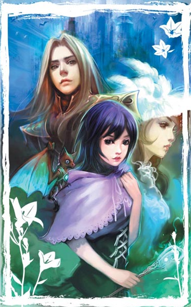

#遺族：暗黑飼養者

##文案：
這是一個將魔法當作「科學」般研究的世界。

屬於遠古魔神的年代早已遠去，上古的血脈變成了做學術研究的好材料，
而七歲小男孩夏夫，就是為了這個才被允許誕生的。
他是『叛神者』巴爾貝雷特家族的正統血脈，卻在實驗室裡被殘酷虐待。

直到一次意外，他的血竟喚醒了一隻被封印了五百年的吸血蝙蝠，
意外古道熱腸的蝙蝠帶著他踏上了逃亡之路，
他們穿過地底隧道，逃過亡靈騎士的攻擊，甚至還遇上了人口販子！

乾扁小蝙蝠其實是一隻尊貴的黑龍？
擁有古老天賦的男孩為隱藏身份，只好變身成小蘿莉？
夏夫究竟能不能逃離中央研究院的魔爪，得到真正的自由呢？

##相關書籍(基本語法練習用)
* 《遺族之暗黑飼養者》上下
* 《遺族之來自過去的人》上下

##同作者相關書籍
  * 《紈褲子弟》
  * **《溫柔之劍》**
加粗為BL

